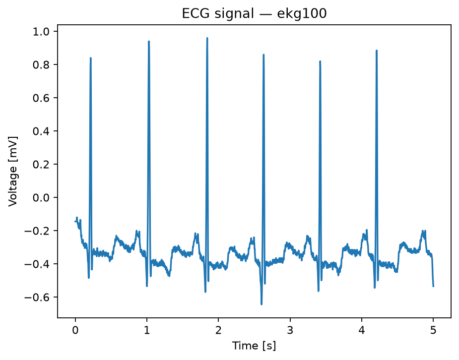
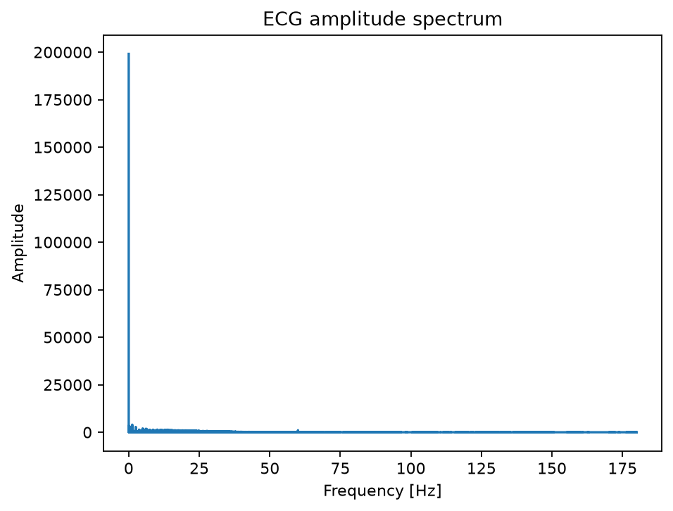
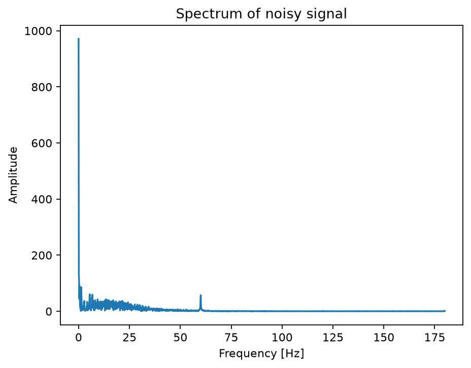
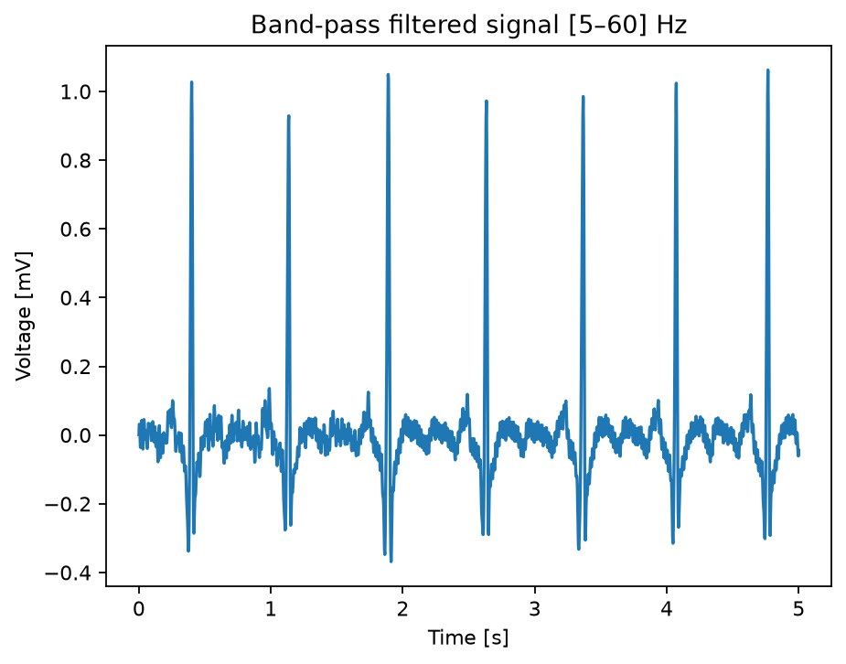
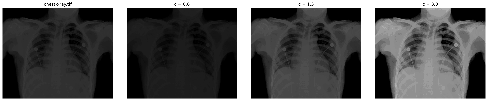
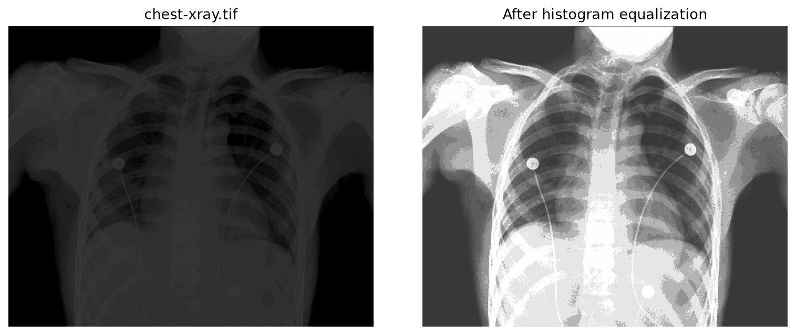
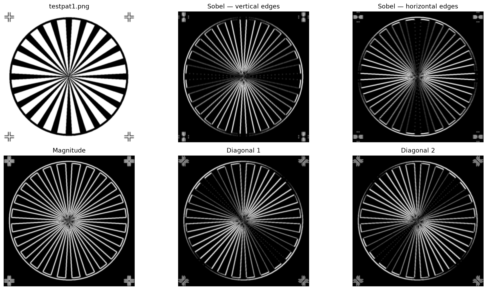
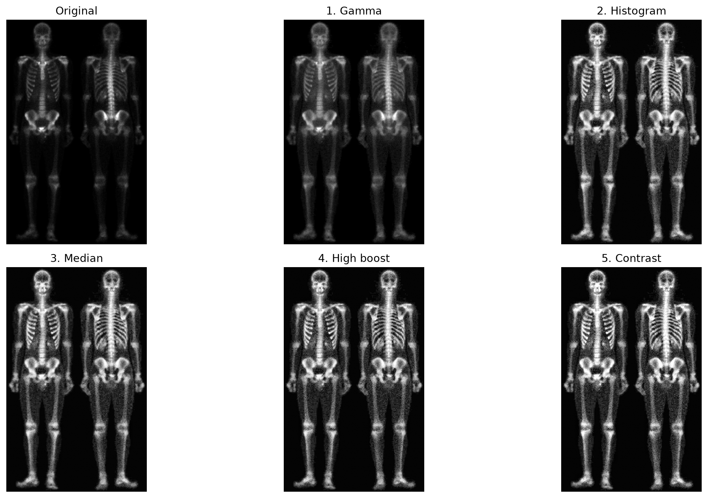

# Signal & Image Processing Projects

A collection of Python projects exploring numerical analysis, signal processing, and digital image processing.

## Projects

### 1. ECG Signal Processing

[`signal-processing/ecg_signal_processing.ipynb`](signal-processing/ecg_signal_processing.ipynb)

Focuses on:

* ECG data loading and preprocessing
* time-domain visualization
* discrete Fourier transform (FFT)
* frequency-spectrum analysis
* inverse FFT reconstruction
* Butterworth low-pass and high-pass filtering
* analysis of noisy ECG signals
* comparison of signals before and after filtering
* reproducible figure and intermediate-data export

**Stack:** Python, NumPy, SciPy, Matplotlib

### 2. Digital Image Processing

[`image-processing/image_processing.ipynb`](image-processing/image_processing.ipynb)

Focuses on:

* grayscale image loading and normalization
* intensity-profile analysis
* point intensity transformations
* histogram equalization
* local contrast enhancement
* local-statistics processing
* salt-and-pepper noise reduction
* mean and Gaussian filtering
* Sobel edge detection
* Laplacian sharpening
* unsharp masking and high-boost filtering
* multi-stage image enhancement

**Stack:** Python, NumPy, SciPy, scikit-image, Pillow, Matplotlib

## Selected Results

The notebooks generate visual comparisons that illustrate how different processing techniques affect signals and images. The examples below highlight representative results from both projects.

### ECG Signal Processing

**ECG signal in the time domain**



A real ECG recording showing the characteristic periodic waveform and QRS complexes.

**Frequency-domain analysis**



The amplitude spectrum shows that most of the ECG signal energy is concentrated at lower frequencies, while sharper waveform components contribute higher-frequency content.

**Noisy signal and frequency analysis**



The noisy recording contains a pronounced component around 60 Hz, corresponding to power-line interference and motivating the filtering stage.

**Filtered ECG**



Sequential Butterworth filtering reduces both high-frequency interference and low-frequency baseline drift, producing a cleaner ECG signal with an effective passband of approximately 5–60 Hz.

### Digital Image Processing

**Point intensity transformations**



Point transformations demonstrate how nonlinear and linear intensity mappings can modify image brightness, contrast, and the distribution of grayscale values.

**Local contrast enhancement**



Local histogram equalization enhances details in regions with limited or uneven contrast. Different neighborhood sizes demonstrate the trade-off between local detail enhancement and noise amplification.

**Edge detection and sharpening**



Sobel filtering highlights directional intensity changes, while Laplacian and high-boost methods emphasize edges and fine image details.

**Multi-stage image enhancement**



The final enhancement pipeline combines gamma correction, local histogram equalization, median filtering, high-boost sharpening, and contrast stretching. Each stage addresses a different aspect of the image and demonstrates the importance of processing order and parameter selection.

## Repository Structure

```text
.
├── signal-processing/
│   ├── ecg_signal_processing.ipynb
│   ├── signals/                 # local input data
│   └── outputs/                 # generated figures and extracted signals
│
├── image-processing/
│   ├── image_processing.ipynb
│   ├── dataset/                 # local input data
│   └── outputs/                 # generated figures and processed images
│
├── requirements.txt
└── README.md
```

## Running the Notebooks

Install the dependencies:

```bash
python -m pip install -r requirements.txt
```

Start Jupyter:

```bash
jupyter notebook
```

Open either notebook from its project directory and run the cells to reproduce the analysis and generated results.

Figures are automatically exported to the corresponding `outputs/` directory.

## Author

### Yevhen Skyba
Computer Engineering Student @ Wrocław University of Science and Technology